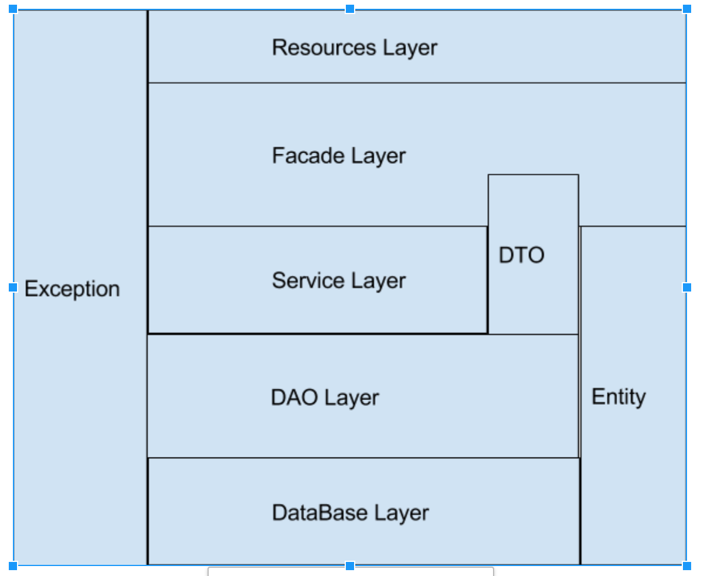

# Bowling Game.

Bowling Game The Nerd Version ;)

## Architecture.



### Prerequisites

Java 8

### Runing

goto bowling/out Directory
open terminal
Run the following Command

```
java -jar bowling.jar
```

## Running Maven with the tests

```
clean install -f pom.xml
```
## Deployment

Add additional notes about how to deploy this on a live system

## Built With

* [JAVA 8] The Language used
* [Maven](https://maven.apache.org/) - Dependency Management
* [JUnit] Unit Test Framework

## Authors

* **Ahmed Ibrahem**

See also Me on Linkedin list of [Linkedin](https://www.linkedin.com/in/ahmedibrahem1/)

